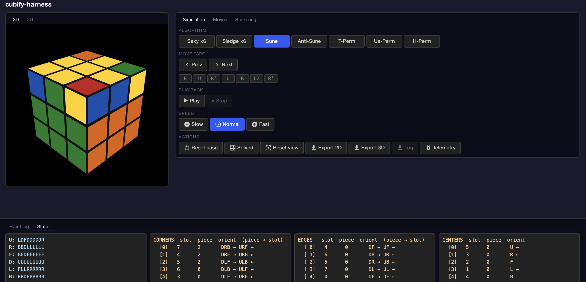

# cubify

Clean-room 3×3 cube rendering and logic library. Built to understand and eventually replace Cubing.js TwistyPlayer in the Learning CFOP app with a dependency-free renderer — no IntersectionObserver constraints, no shadow DOM, no baked-in controls, and CSS themes.

## Packages

This repo is an npm workspace publishing two packages to [GitHub Packages](https://github.com/andyjudson?tab=packages):

| Package | Description |
|---------|-------------|
| `@andyjudson/cubify` | Core cube library — state, rendering, animation, export |
| `@andyjudson/cubify-react` | React wrappers — `<CubePlayer>`, `<CubeState>`, `<CubeMoveTape>`, `<CubePlayerControls>` |

## Install

```bash
# .npmrc (add to your project)
@andyjudson:registry=https://npm.pkg.github.com
//npm.pkg.github.com/:_authToken=${NPM_AUTH_TOKEN}

# Install
npm install @andyjudson/cubify three cubing
npm install @andyjudson/cubify-react react react-dom react-icons  # if using React
```

GitHub Packages requires auth even for public packages. Use a GitHub PAT with `read:packages` scope locally; in CI use `GITHUB_TOKEN`.

See [`specs/031-cubify-packages/quickstart.md`](specs/031-cubify-packages/quickstart.md) for full setup, usage examples, and local dev workflow.

## Library API (`@andyjudson/cubify`)

| Module | Description |
|--------|-------------|
| `CubeState` | cubing.js KPattern wrapper — `applyMove/applyAlg`, `toFaceArray()`, `isSolved()`, `invertAlg()` |
| `CubeScramble` | Pure JS scramble generator — `CubeScramble.random(length?)` |
| `AlgParser` | WCA notation parser (face turns, wide moves, slice moves, rotations) |
| `CubeStickering` | CFOP orbit-string masking; `MASK_PRESETS` (15 presets); chars -/I/D/O/S/P |
| `CubeTheme` | Theme system — `THEME_PRESETS` (default/rubiks/speed-dark/speed-light), `DEFAULT_THEME` |
| `CubeRenderer2D` | Top-down 2D renderer — `toSVG()`, canvas `update()`, `setTheme()` |
| `CubeRenderer3D` | Three.js 3D renderer — `animateMove()`, `setSpeed()`, `applyStickering()`, `snapshotAt()` |
| `CubePlayer` | Animation engine — `loadAlg()`, `play/pause/jumpTo/reset`, events (`move`, `complete`, `reset`) |
| `CubeExporter` | `toPNG(alg, { style: '2d'\|'3d' })` — transparent PNG export |

## Development

```bash
npm install                               # install workspace deps
npm test                                  # Vitest suite (181 pass, 10 skip)
npm run dev                               # Vite dev server → cubify-harness/index.html
npm run build --workspace=packages/cubify          # tsc build → packages/cubify/dist/
npm run build --workspace=packages/cubify-react    # tsc build → packages/cubify-react/dist/
```

## Publishing

```bash
bash scripts/version-bump.sh 1.1.0   # bumps both packages, commits, tags
git push && git push --tags           # triggers publish.yml CI → GitHub Packages
```

## cubify-harness

Interactive browser dev environment — algorithm selector, play/step controls, export buttons.



| File | Description |
|------|-------------|
| `cubify-harness/index.html` | Interactive harness UI |
| `packages/cubify/test/` | Vitest suite — 181 tests, no headed browser |
| `cubify-harness/verify-perms.mjs` | 18-test permutation cross-check against cubing.js ground truth |

## cubify-scripts

Node.js CLI for on-demand cube image generation. Used as the `/cubify` Claude Code skill.

```bash
node cubify-scripts/cubify.mjs "R U R' U R U2 R'"
node cubify-scripts/cubify.mjs --case oll_sune --masked --2d
node cubify-scripts/cubify.mjs --file algs-cfop-oll.json --masked --2d
```

Requires headful Chromium (WebGL blocked in headless on macOS):

```bash
cd cubify-scripts && npx playwright install chromium
ln -s /path/to/cfop/cfop-app/public/data cubify-scripts/data
```

## Reference Docs

| Doc | Content |
|-----|---------|
| [`specs/031-cubify-packages/quickstart.md`](specs/031-cubify-packages/quickstart.md) | Install, import paths, local dev workflow |
| [`specs/cubing-js-architecture.md`](specs/cubing-js-architecture.md) | Cubing.js KPuzzle/KPattern data model |
| [`specs/cube-mapping-lessons.md`](specs/cube-mapping-lessons.md) | Hard-won implementation gotchas |
| [`specs/cube-physical-rules.md`](specs/cube-physical-rules.md) | Physical cube geometry, CFOP conventions |

## Built With

- **[cubing.js](https://github.com/cubing/cubing.js)** (Lucas Garron) — KPattern state model
- **Three.js** — 3D rendering
- **Playwright** (cubify-scripts only) — headful Chromium screenshot capture

## License

MIT License — see [LICENSE](LICENSE) for details.

---

**Status**: Features 022–031 complete • 032 planned
